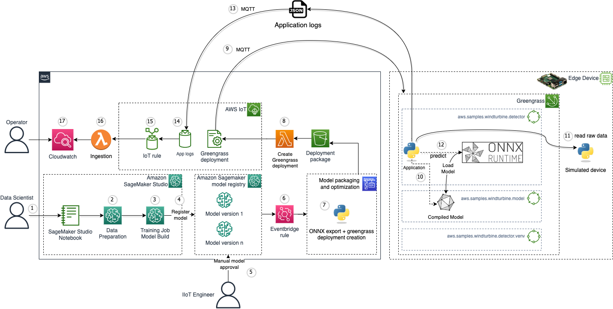
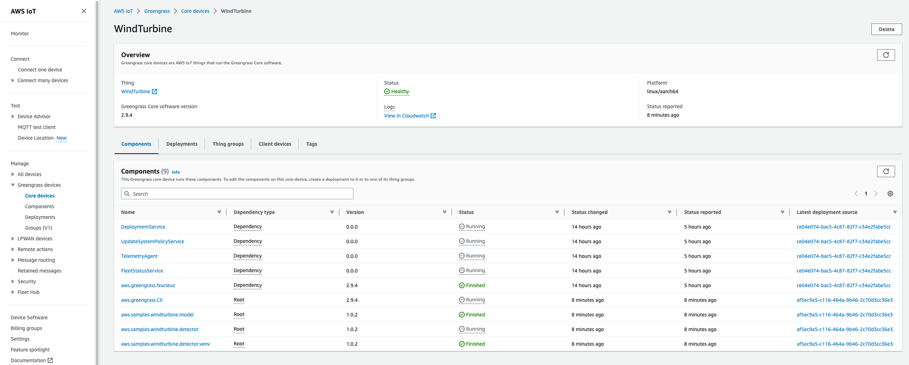

# Code sample using AWS IoT Greengrass V2

# Solution architecture

This code sample can be used to manage the full lifecycle of ML models deployed to edge devices. Prepare your model with [Amazon SageMaker](https://aws.amazon.com/sagemaker/)  and deploy and run the model on edge devices (e.g. Raspberry Pi) with AWS Greengrass v2. Edge application logs are streamed back to the cloud for visualization within Amazon Cloudwatch. We use the ONNX Runtime to scale to different device frameworks and hardware ML accelerators.

While you can use this code sample to deploy any type of model to an edge device, our example uses [Amazon SageMaker](https://aws.amazon.com/sagemaker/) to train an AutoEncoder using wind turbine sensor data acquired from a simulated device, exports the model to the ONNX format, and deploys it to a Raspberry Pi. Each edge device has a Python application which reads the raw data from the simulated device and performs prediction using the ONNX model. For each edge device there is a Greengrass core device. This is required by the application that runs on the edge device to send logs to the cloud and for the OTA model update mechanism. The application collects some metrics from the predictions, as well as the simulated device readings, and sends them to an MQTT topic. Lambda functions process the data from the MQTT topic and ingests it to Amazon Cloudwatch logs. This data can then be visualized using an Amazon Cloudwatch dashboard.



1. A data scientist uses [Sagemaker Studio](https://docs.aws.amazon.com/sagemaker/latest/dg/studio.html) to prepare a ML model
2. Sensor data preparation
3. A model is trained (windturbine)
4. The model is registered in the [Sagemaker Model Registry](https://docs.aws.amazon.com/sagemaker/latest/dg/model-registry.html) with a new version, awaiting approval
5. An IIoT engineer validates manually the model version 
6. When a model is approved, an [Amazon Eventbridge rule](https://docs.aws.amazon.com/eventbridge/latest/userguide/eb-rules.html) triggers a new deployment
7. Model is exported to the ONNX format, then saved in an [Amazon Simple Storage Service](https://aws.amazon.com/s3/) (S3) bucket. Three AWS IoT Greengrass components are created and published (one containing the model, one containing the detector python application, and one creating a virtual environment and installing all the dependencies)
8. A notification is triggered once the new object is put into S3. An AWS IoT Greengrass deployment is created through an [AWS Lambda](https://aws.amazon.com/lambda/) function targetting the edge devices
9. The Greengrass components are deployed on the target device through the Greengrass deployment. The edge device is running the Greengrass core runtime.
10. The model is loaded and a new ONNX runtime inference session is started
11. The application reads raw data from the simulated device through a local MQTT broker
12. The application runs a prediction based on the acquired raw data
13. Application logs are captured and published to an MQTT topic
14. An IoT rule reads the application logs
15. A Lambda function parses the application logs
16. Parsed data are ingested to [Amazon Cloudwatch logs](https://docs.aws.amazon.com/AmazonCloudWatch/latest/logs/WhatIsCloudWatchLogs.html)
17. An operator can access the Cloudwatch dashboard and visualize anomalies and other information

To learn more about AWS IoT Greengrass, check out [how AWS IoT Greengrass works](https://docs.aws.amazon.com/greengrass/v2/developerguide/how-it-works.html)

Each Greengrass core device (Raspberry pi) contains a full deployment of the components detailed in the architecture above.

# Getting started

## Pre-requisites

- An AWS account. We recommend to deploy this solution in a new account
- [AWS CLI](https://aws.amazon.com/cli/): configure your credentials

```
aws configure --profile [your-profile] 
AWS Access Key ID [None]: xxxxxx
AWS Secret Access Key [None]:yyyyyyyyyy
Default region name [None]: us-east-1 
Default output format [None]: json
```

- Node.js: v18.12.1
- [AWS CDK](https://github.com/aws/aws-cdk/releases/tag/v2.94.0): 2.94.0
- [Projen](https://projen.io/): 0.65.14
```
npm install -g npm aws-cdk projen
```
- jq: jq-1.6
- Raspberry Pi (tested with a Raspberry Pi 4)

## Deploy the solution

This project is built using [Cloud Development Kit (CDK)](https://aws.amazon.com/cdk/) and [projen](https://github.com/projen/projen). See [Getting Started With the AWS CDK](https://docs.aws.amazon.com/cdk/v2/guide/getting_started.html) for additional details and prerequisites. When running the commands below, projen will run ```python``` and not ```python3```, so make sure your ```python``` command runs the correct Python version. 

1. Clone this repository.
    ```shell
    $ git clone https://github.com/aws-samples/ml-edge-getting-started/
    ```

2. Enter the code sample directory.
    ```shell
    $ cd samples/onnx_accelerator_sample1
    ```

3. Verify that the project is configured to deploy the AWS IoT Greengrass version. Open the file ```.projenrc.py``` and verify that the value for ```use_greengrass``` on line 27 is set to ```True```. If not, update the value and then run the follwing command to install the project:
    ```shell
    $ npx projen install
    ```
 
3. Run a full build.
    ```shell
    $ npx projen build
    ```

4. Boostrap AWS CDK resources on the AWS account.
    ```shell
    $ npx cdk bootstrap
    ```

5. Deploy the sample in your account
    ```shell
    $ npx cdk deploy
    ```

Once the stack is deployed, go to the AWS Console and then Cloudformation -> Stacks -> onnxacceleratorsampleone-dev -> Outputs

The following outputs are generated:
- cfnoutputdatascientistteamA    : The User Arn user for the sagemaker user representing the data science team
- cfnoutputIIoTengineeringteam : The User Arn for the SageMaker user representing the IIoT engineers team
- CodeBuildInputArtifactsS3BucketName    : The S3 bucket containing the input artifacts for codebuild (python script)    
- DashboardOutput    : URL of the Cloudwatch dashboard providing visualization of anomalies and raw data
- DeploymentPackageS3BucketName : The S3 bucket containing the deployment artifacts for edge devices (onnx exported model + job json file)
- DomainIdSagemaker : The SagemMaker domain ID

> **Note**
> SageMaker Studio will be provisioned using the default VPC, thus the default VPC needs to exist. If you want to use a different VPC, update ```default_vpc_id = ec2.Vpc.from_lookup(self, "DefaultVPC", is_default=True)``` in [main_stack.py](./onnxacceleratorsampleone/main_stack.py)

## Edge device

After successfully deploying the project, you need to configure your edge device (Raspberry Pi).

> **Note**
> If you don't have a Raspberry Pi, you can use a target with an operating system as an edge device, like an [EC2 instance](https://docs.aws.amazon.com/AWSEC2/latest/UserGuide/Instances.html). In that case, you will need to udpate the recipes for the [components](./onnxacceleratorsampleone/with_ggv2/components/). For each component, open the yaml recipe file and replace the os/architecture with the values corresponding to your target. Once done, repeat the previous step to synthesize (```cdk synth```) and redeploy the project (```cdk deploy```).

### Dependencies

On your edge device, make sure you have [installed Python 3, pip3 and virtualenv](https://packaging.python.org/en/latest/guides/installing-using-pip-and-virtual-environments/)

### Simulated device

In [this directory](./simulated_device/) you'll find the Python application that runs on each edge device and streams synthetic raw turbine data, which has been collected from real sensors installed in a 3D printed mini wind turbine. The README in that folder provides instructions on how to configure and run that application.

> **Warning**
> To keep things simple, the simulated device and the windturbine detector component are communicating through a local MQTT broker, unauthenticated. To secure your connection, you can follow the steps described in the [AWS IoT Greengrass V2 workshop](https://catalog.us-east-1.prod.workshops.aws/workshops/5ecc2416-f956-4273-b729-d0d30556013f/en-US/chapter6-mqtt-broker)

### AWS IoT Greengrass

The following steps are also described in the dedicated AWS IoT Immersion Day Workshop: https://catalog.workshops.aws/aws-iot-immersionday-workshop/en-US/aws-greengrassv2/greengrass-physicaldevice/lab37-rpi-greengrass-basics

- Follow the steps in the following link to create a user and get credentials: https://catalog.workshops.aws/aws-iot-immersionday-workshop/en-US/aws-greengrassv2/greengrass-physicaldevice/lab37-rpi-greengrass-basics#create-an-aws-user-for-device-provisioning under Step 2

    When prompted to enter the "core device name" and "thing group name", use the following values:
    - Core device name: WindTurbine
    - thing group name: WindTurbines
  
    Follow the remaining instructions in Step 2 to install the Greengrass Core software on your Raspberry Pi using the credentials you previously created.
    ```
    curl -s https://d2s8p88vqu9w66.cloudfront.net/releases/greengrass-nucleus-latest.zip > greengrass-nucleus-latest.zip && unzip greengrass-nucleus-latest.zip -d GreengrassInstaller
    ```
    Replace the region in the next command if different from ```us-east-1```
    ```
    sudo -E java -Droot="/greengrass/v2" -Dlog.store=FILE -jar ./GreengrassInstaller/lib/Greengrass.jar --aws-region us-east-1 --thing-name WindTurbine --thing-group-name WindTurbines --component-default-user ggc_user:ggc_group --provision true --setup-system-service true --deploy-dev-tools true
    ```
    Verify that Greengrass is correctly running on the Raspberry Pi: 
    ```
    sudo systemctl status greengrass.service
    ```

- Each core device has a core device IAM role that allows it to interact with AWS IoT and send logs to the AWS Cloud. This device role doesn't allow access to S3 buckets by default, so you must create and attach a policy that allows the core device to retrieve component artifacts from the S3 bucket.
In the IAM console navigation menu, choose Policies, and then choose Create policy. On the JSON tab, replace the placeholder content with the following policy (replace DEPLOYMENT_BUCKET_NAME with the value of the following Clouformation output: ```onnxacceleratorsampleone-dev.DeploymentPackageS3BucketName```)

    ```
    {
    "Sid": "DownloadArtifacts",
    "Effect": "Allow",
    "Action": [
        "s3:GetObject"
    ],
    "Resource": "arn:aws:s3:::<DEPLOYMENT_BUCKET_NAME>/*"
    }
    ```
    Choose Next: Tags, and then choose Next: Review.
    For Name, enter ```GreengrassV2ComponentArtifactPolicy``` and click Create policy.

    In the IAM console navigation menu, choose Role, and then choose the name of the role for the core device. You specified this role name when you installed the AWS IoT Greengrass Core software. If you did not specify a name, the default is GreengrassV2TokenExchangeRole.

    Under Permissions, choose Add permissions, then choose Attach policies.

    On the Add permissions page, select the check box next to the ```GreengrassV2ComponentArtifactPolicy``` policy that you created, and then choose Attach policies.

- Click ```IoT Core``` -> ```Greengrass devices``` -> ```Core devices``` from the AWS console to view the created device 
- Click ```IoT Core``` -> ```Greengrass devices``` -> ```Deployments``` from the AWS console to view the created deployment, named ```Deployment for Windturbines``` 

Your device is now ready for the next steps.

## Notebooks

Once your edge device is configured correctly, you can build and deploy the ML model.

1. In the AWS Console, go to Amazon SageMaker and select Studio. 
2. In the Get Started right panel, select the ```datascientist-team-a``` and click Open Studio.
3. On the left menu bar, select Git and Clone a Repository
4. In the drop-down enter https://github.com/aws-samples/ml-edge-getting-started.git
5. Select the explorer view, select ```ml-edge-getting-started/samples/onnx_accelerator_sample1/notebooks``` and open the notebook ```01 - Data Preparation.ipynb```

If prompted to setup a notebook environment, select the image ```Data Science 3.0```


6. Execute the cells in the notebook to transform (feature selection, cleaning, denoising, normalizing, etc) the sensors data (raw) into a dataset used to train the model
7. In the explorer view, select ```ml-edge-getting-started/samples/onnx_accelerator_sample1/notebooks``` and open the notebook ```02 - Training with Pytorch.ipynb```
8. Execute the cells in the notebook to train the model (Pytorch Autoencoder), and register it in the Amazon Sagemaker Model registry. The model artifacts will also be stored in the sagemaker default Amazon Simple Storage Service (S3) bucket.
9. On the left menu bar, select ```Home``` -> ```Models``` -> ```Model registry```
10. Double click the ```modelPackageGroupTurbine``` model group name
11. Select the model version you just created, double click on it and update its status in the top right corner from ```PendingManualApproval``` to ```Approved```


## Model export and deployment

Approving the model version in the Amazon SageMaker Model registry triggers a model deployment at the edge. The Eventbridge rule sends an event to Codebuild with information about the model you just approved. A new build step is then triggered, pulling the model artifact and exporting it to the ONNX format. This step is performed in [build_deployment_package.py](./onnxacceleratorsampleone/with_ggv2/build_deployment_package.py). 

Three Greengrass components are built. The code for each component is located in the [components](./onnxacceleratorsampleone/with_ggv2/components/) folder:
- ```aws.samples.windturbine.detector``` : python application running the raw data acquisition, prediction (inference) and streaming to IoT Core of the application logs
- ```aws.samples.windturbine.detector.venv``` : creates a Python virtual environment and install all the Python modules necessary for the application
- ```aws.samples.windturbine.model``` : contains the onnx model as artifact

Each component version is set to ```1.0.model_version```

> **Warning**
> Since each component version is configured using the model version, if you approve a model version which is the same as an existing component, the codebuild step will fail. This is because gdk cannot create a component version which already exists. You can delete the existing component version and re-run the build.

Codebuild uses the [Greengrass development kit](https://github.com/aws-greengrass/aws-greengrass-gdk-cli) to build and publish the Greengrass components.

The component artifacts are compressed and pushed to the Amazon S3 deployment bucket, along with a trigger json file. A notification is configured on this bucket to invoke asynchronously an AWS Lambda function ([lambda.py](./functions/greengrassdeploymentcreator/src/lambda.py)) when a file ending in ```.json``` is pushed. The Lambda function receives an event that contains details about the object.

The lambda function updates the existing IoT Greengrass deployment targetting all the devices in the specified thing group. It gets the **latest available version** of each component and adds it to the deployment. You can change this behavior to update, for instance, only the model component and keep the two other components with fixed versions.

Once the deployment is created and succesfully applied to your device, you can navigate to ```IoT Core``` -> ```Greengrass devices``` -> ```Core devices```, select your ```Windturbine``` device and see the components



On your Raspberry Pi, you can view the logs generated by each component by running the following command (replace <component_name> with the name of a component, for instance ```aws.samples.windturbine.detector```):

```shell
    $ sudo tail -1000f /greengrass/v2/logs/<component_name>.log
```

## Visualization

Access the Amazon Cloudwatch dashboard using the URL output provided by your Cloudformation stack. Four widgets are available with sample queries to visualize useful information (input data, anomalies). You can modify those queries in [main_stack.py](./onnxacceleratorsampleone/main_stack.py) if you want to display different data.


## Clean up

Do not forget to delete the stack to avoid unexpected charges.

First remove all data (model versions) from the model registry. Then:

```shell
    $ cdk destroy onnxacceleratorsampleone-dev
```

Then in the AWS Console, delete the components, deployments, core device, and S3 buckets.