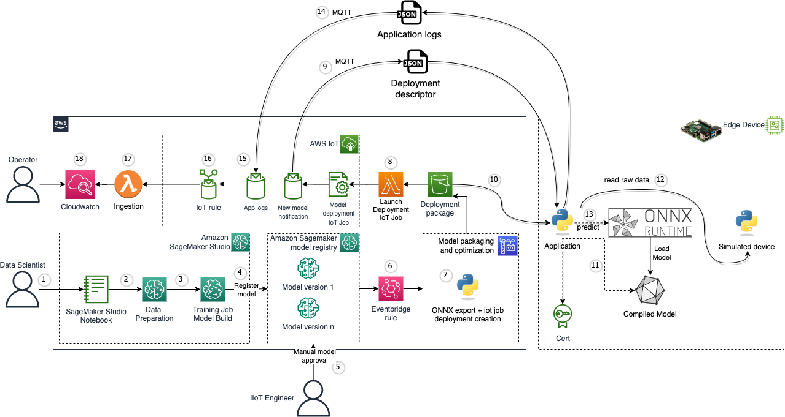
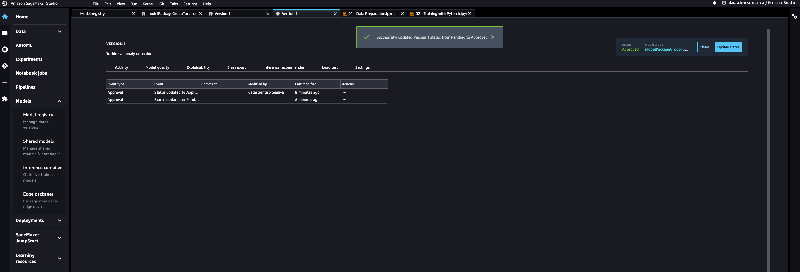
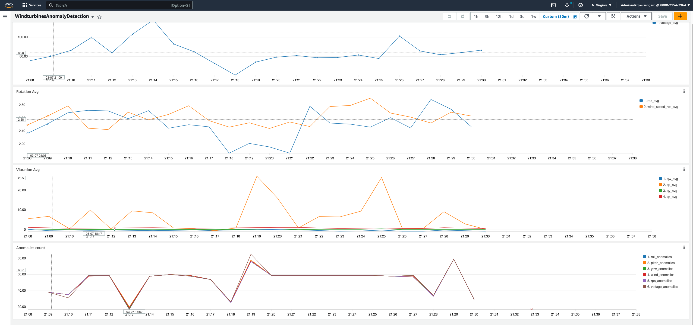

# Code sample using AWS IoT Jobs

# Solution architecture

The idea is to use [Amazon SageMaker](https://aws.amazon.com/sagemaker/) to train an AutoEncoder using the Turbine sensors data acquired from the simulated device, export the model to the ONNX format, and deploy it on the edge device (Raspberry Pi). Each edge device has a python application which reads the raw data from the simulated device, and performs prediction using the ONNX model to detect anomalies. For each edge device there is an IoT Thing. This is required by the application that runs on the edge device to send logs to the cloud and for the OTA model update mechanism. The application collects some metrics from the predictions as well as the simulated device readings and sends them to an MQTT topic. Lambda functions process the data from the MQTT topic and ingests it to Amazon Cloudwatch logs. This data can then be visualized using an Amazon Cloudwatch dashboard.




1. A data scientist uses [Sagemaker Studio](https://docs.aws.amazon.com/sagemaker/latest/dg/studio.html) to prepare a ML model
2. Sensor data preparation
3. A model is trained (windturbine)
4. The model is registered in the [Sagemaker Model Registry](https://docs.aws.amazon.com/sagemaker/latest/dg/model-registry.html) with a new version, awaiting approval
5. An IIoT engineer validates manually the model version 
6. When a model is approved, an [Amazon Eventbridge rule](https://docs.aws.amazon.com/eventbridge/latest/userguide/eb-rules.html) triggers a new deployment
7. Model is exported to the ONNX format along with an [AWS IoT job](https://docs.aws.amazon.com/iot/latest/developerguide/iot-jobs.html) file, then saved in an [Amazon Simple Storage Service](https://aws.amazon.com/s3/) (S3) bucket
8. A notification is triggered once the new object is put into S3. An AWS IoT job is created through an [AWS Lambda](https://aws.amazon.com/lambda/) function and a notification is sent to the edge device
9. The application is subscribed to an MQTT topic, and receives a JSON document with the model metadata
10. The application downloads the model from the S3 bucket to a local directory
11. The model is loaded and a new ONNX runtime inference session is started
12. The application reads raw data from the simulated device through a local MQTT broker
13. The application runs a prediction based on the acquired raw data
14. Application logs are captured and published to an MQTT topic
15. An IoT rule reads the application logs
16. A Lambda function parses the application logs
17. Parsed data are ingested to [Amazon Cloudwatch logs](https://docs.aws.amazon.com/AmazonCloudWatch/latest/logs/WhatIsCloudWatchLogs.html)
18. An operator can access the Cloudwatch dashboard and visualize anomalies and other information

# Getting started

## Pre-requisites

- An AWS account. We recommend to deploy this solution in a new account
- [AWS CLI](https://aws.amazon.com/cli/): configure your credentials

```
aws configure --profile [your-profile] 
AWS Access Key ID [None]: xxxxxx
AWS Secret Access Key [None]:yyyyyyyyyy
Default region name [None]: us-east-1 
Default output format [None]: json
```

- Node.js: v18.12.1
- [AWS CDK](https://github.com/aws/aws-cdk/releases/tag/v2.94.0): 2.94.0
- [Projen](https://projen.io/): 0.65.14
```
npm install -g npm aws-cdk projen
```
- jq: jq-1.6
- Raspberry Pi (tested with a Raspberry Pi 4)

## Deploy the solution

This project is built using [Cloud Development Kit (CDK)](https://aws.amazon.com/cdk/) and [projen](https://github.com/projen/projen). See [Getting Started With the AWS CDK](https://docs.aws.amazon.com/cdk/v2/guide/getting_started.html) for additional details and prerequisites. When running the commands below, projen will run ```python``` and not ```python3```, so make sure your ```python``` command runs the correct Python version. 

1. Clone this repository.
    ```shell
    $ git clone https://github.com/aws-samples/ml-edge-getting-started/
    ```

2. Enter the code sample directory.
    ```shell
    $ cd samples/onnx_accelerator_sample1
    ```

3. Verify that the project is configured to deploy the AWS IoT Jobs version. Open the file ```.projenrc.py``` and verify that the value for ```use_greengrass``` on line 27 is set to ```False```. If not, update the value and then run the follwing command to synthesize the project:
    ```shell
    $ npx projen
    ```
 
3. Activate virtualenv, install dependencies and synthesize.
    ```shell
    $ npx projen build
    ```

4. Boostrap AWS CDK resources on the AWS account.
    ```shell
    $ npx cdk bootstrap
    ```

5. Deploy the sample in your account
    ```shell
    $ npx cdk deploy
    ```

Once the stack is deployed, in the console go to Cloudformation -> Stacks -> onnxacceleratorsampleone-dev -> Outputs

The following outputs will be available to you:
- cfnoutputdatascientistteamA	: The User Arn user for the sagemaker user representing the Data science team
- cfnoutputIIoTengineeringteam : The User Arn for the sagemaker user representing the IIoT Engineers team
- CodeBuildInputArtifactsS3BucketName	: The S3 bucket containing the input artifacts for codebuild (python script)	
- DashboardOutput	: URL of the Cloudwatch dashboard providing visualization of anomalies and raw data
- DeploymentPackageS3BucketName : The S3 bucket containing the deployment artifacts for edge devices (onnx exported model + job json file)
- DomainIdSagemaker : The sagemaker domain ID

> **Note**
> Sagemaker Studio will be provisioned using the default VPC, thus it needs to exist. If you want to use a different VPC, udpate ```default_vpc_id = ec2.Vpc.from_lookup(self, "DefaultVPC", is_default=True)``` in [main_stack.py](./onnxacceleratorsampleone/main_stack.py)

## Edge device

After successfully deploying the project, you need to configure your edge device (Raspberry Pi).

### Simulated device

In [this directory](./simulated_device/) you'll find the Python application that runs on each edge device and streams synthetic raw turbine data, which has been collected from real sensors installed in a 3D printed mini wind turbine. The README in that folder provides instructions on how to configure and run that application.

> **Warning**
> To keep things simple for this code sample, the simulated device and the detector application are communicating through a local MQTT broker, unauthenticated. Do not use this in production. It is a security best practice to always use an encrypted, secured connection.

### Edge Application

In [this directory](./edge_application/) you'll find the Python application that runs on each edge device and performs predictions as well as communication with the cloud. The README in that folder provides instructions on how to configure and run that application. 

## Notebooks

Once your edge device is configured correctly, you can train and deploy the ML model.

1. In the AWS console, go to Amazon Sagemaker and select Studio. 
2. In the Get Started right panel, select the ```datascientist-team-a``` and click Open Studio.
3. On the left menu bar, select Git and Clone a Repository
4. In the drop-down enter https://github.com/aws-samples/ml-edge-getting-started.git
5. Select the explorer view, select ```ml-edge-getting-started/samples/onnx_accelerator_sample1/notebooks``` and open the notebook ```01 - Data Preparation.ipynb```

If prompted to setup a notebook environment, select the image ```Data Science 3.0```


6. Execute the cells in the notebook to transform (feature selection, cleaning, denoising, normalizing, etc) the sensors data (raw) into a dataset used to train the model
7. In the explorer view, select ```ml-edge-getting-started/samples/onnx_accelerator_sample1/notebooks``` and open the notebook ```02 - Training with Pytorch.ipynb```
8. Execute the cells in the notebook to train the model (Pytorch Autoencoder), and register it in the Amazon Sagemaker Model registry. The model artifacts are stored in the sagemaker default Amazon Simple Storage Service (S3) bucket.
9. On the left menu bar, select ```Home``` -> ```Models``` -> ```Model registry```
10. Double click the ```modelPackageGroupTurbine``` model group name
11. Select the model version you just created, double click on it and update its status in the top right corner from ```PendingManualApproval``` to ```Approved```



## Model export and deployment

Approving the model version in the Amazon Sagemaker Model registry will trigger a model deployment at the edge. The Eventbridge rule sends an event to Codebuild with information about the model you just approved. A new build step is then triggered, pulling the model artifact and exporting it to the ONNX format. This step is performed in [build_deployment_package.py](./onnxacceleratorsampleone/without_ggv2/build_deployment_package.py). 

The new model artifact, along with an IoT Job file is pushed to the Amazon S3 deployment bucket. A notification is configured on this bucket to invoke asynchronously an AWS Lambda function ([lambda.py](./functions/iotjobcreator/src/lambda.py)) when a file ending in ```.json``` is pushed. The Lambda function receives an event that contains details about the object. 

The lambda function creates an IoT Job targetting all the devices in the specified thing group. Each device receives a notification that a new model is available, and download it using the pre-signed S3 URL present in the job document. When done, the device reports its status (job succeeded or not). You can visualize these jobs by clicking, in the AWS console, ```AWS IoT``` -> ```Remote actions``` -> ```Jobs```

## Visualization

Access the Amazon Cloudwatch dashboard using the URL output generated by your cloudformation stack. Four widgets are available with sample queries to visualize useful information (input data, anomalies). You can modify those queries in [main_stack.py](./onnxacceleratorsampleone/main_stack.py) if you want to display different data.



## Clean up

Do not forget to delete the stack to avoid unexpected charges

First make sure to remove all data (model versions) from the model registry. Then:

```shell
    $ cdk destroy onnxacceleratorsampleone-dev
```

Then in the AWS console delete the iot thing, thing group, thing type, device certificates and the S3 buckets