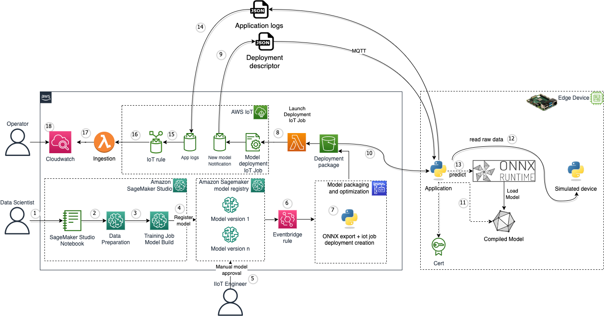

# Onnx ML at the edge

This code sample provides an end-to-end solution that manages the lifecycle of ML models deployed to a simulated wind turbine fleet. 

Using a Machine Learning model ([Autoencoder](https://en.wikipedia.org/wiki/Autoencoder)) you can analyze the turbine sensors data and detect anomalies. This technique is important to improve the maintenance process and reduce the operational cost.

This code sample is a variant of the solution presented in [this](https://aws.amazon.com/blogs/machine-learning/monitor-and-manage-anomaly-detection-models-on-a-fleet-of-wind-turbines-with-amazon-sagemaker-edge-manager/) blog post, without using Sagemaker Edge Manager. The blog post contains useful information about the custom ML model trained.

# Solution architecture

The idea is to use [Amazon SageMaker](https://aws.amazon.com/sagemaker/) to train an AutoEncoder using the Turbine sensors data acquired from the simulated device, export the model to the ONNX format, and deploy it on the edge device (Raspberry Pi). Each edge device has a python application which reads the raw data from the simulated device, and performs prediction using the ONNX model to detect anomalies. For each edge device there is an IoT Thing. This is required by the application that runs on the edge device to send logs to the cloud and for the OTA model update mechanism. The application collects some metrics from the predictions as well as the simulated device readings and sends them to an MQTT topic. Lambda functions process the data from the MQTT topic and ingests it to Amazon Cloudwatch logs. This data can then be visualized using an Amazon Cloudwatch dashboard.




1. A data scientist uses [Sagemaker Studio](https://docs.aws.amazon.com/sagemaker/latest/dg/studio.html) to prepare a ML model
2. Sensor data preparation
3. A model is trained (windturbine)
4. The model is registered in the [Sagemaker Model Registry](https://docs.aws.amazon.com/sagemaker/latest/dg/model-registry.html) with a new version, awaiting approval
5. An IIoT engineer validates manually the model version 
6. When a model is approved, an [Amazon Eventbridge rule](https://docs.aws.amazon.com/eventbridge/latest/userguide/eb-rules.html) triggers a new deployment
7. Model is exported to the ONNX format along with an [AWS IoT job](https://docs.aws.amazon.com/iot/latest/developerguide/iot-jobs.html) file, then saved in an [Amazon Simple Storage Service](https://aws.amazon.com/s3/) (S3) bucket
8. A notification is triggered once the new object is put into S3. An IoT job is created through an [AWS Lambda](https://aws.amazon.com/lambda/) function and a notification is sent to the edge device
9. The application is subscribed to an MQTT topic, and receives a JSON document with the model metadata
10. The application downloads the model from the S3 bucket to a local directory
11. The model is loaded and a new ONNX runtime inference session is started
12. The application reads raw data from the simulated device through an MQTT broker
13. The application runs a prediction based on the acquired raw data
14. Application logs are captured and published to an MQTT topic
15. An IoT rule reads the application logs
16. A Lambda function parses the application logs
17. Parsed data are ingested to [Amazon Cloudwatch logs](https://docs.aws.amazon.com/AmazonCloudWatch/latest/logs/WhatIsCloudWatchLogs.html)
18. An operator can access the Cloudwatch dashboard and visualize anomalies and other information

# Getting started

## Pre-requisites

- An AWS account. We recommend to deploy this solution in a new account
- [AWS CLI](https://aws.amazon.com/cli/): configure your credentials

```
aws configure --profile [your-profile] 
AWS Access Key ID [None]: xxxxxx
AWS Secret Access Key [None]:yyyyyyyyyy
Default region name [None]: us-east-1 
Default output format [None]: json
```

- Node.js: v18.12.1
- [AWS CDK](https://github.com/aws/aws-cdk/releases/tag/v2.68.0): 2.68.0
- jq: jq-1.6
- Raspberry Pi (tested with a Raspberry Pi 4)

## Deploy the solution

This project is built using [Cloud Development Kit (CDK)](https://aws.amazon.com/cdk/) and [projen](https://github.com/projen/projen). See [Getting Started With the AWS CDK](https://docs.aws.amazon.com/cdk/v2/guide/getting_started.html) for additional details and prerequisites

1. Clone this repository.
    ```shell
    $ git clone https://github.com/aws-samples/ml-edge-getting-started/
    ```

2. Enter the code sample directory.
    ```shell
    $ cd samples/onnx_accelerator_sample1
    ```

3. Boostrap AWS CDK resources on the AWS account.
    ```shell
    $ cdk bootstrap
    ```
4. Build the project locally.
    ```shell
    $ npx projen build
    ```
5. Deploy the sample in your account
    ```shell
    $ cdk deploy
    ```

Once the stack is deployed, in the console go to Cloudformation -> Stacks -> onnxacceleratorsampleone-dev -> Outputs

The following outputs will be available to you:
- cfnoutputdatascientistteamA	: The User Arn user for the sagemaker user representing the Data science team
- cfnoutputIIoTengineeringteam : The User Arn for the sagemaker user representing the IIoT Engineers team
- CodeBuildInputArtifactsS3BucketName	: The S3 bucket containing the input artifacts for codebuild (python script)	
- DashboardOutput	: URL of the Cloudwatch dashboard providing visualization of anomalies and raw data
- DeploymentPackageS3BucketName : The S3 bucket containing the deployment artifacts for edge devices (onnx exported model + job json file)
- DomainIdSagemaker : The sagemaker domain ID

## Notebooks

Clone this repo in Sagemaker Studio. You will run two notebooks there:

[Dataset preparation](./notebooks/01%20-%20Data%20Preparation.ipynb): to transform (feature selection, cleaning, denoising, normalizing, etc) the sensors data (raw) into a dataset used to train the model

[Model preparation](./notebooks/02%20-%20Training%20with%20Pytorch.ipynb): to train (Pytorch Autoencoder), register the model in the model registry

Once the model is registered, changing its status from "pending manual approval" to "approved" will trigger a model deployment at the edge. 

## Simulated device

In [this directory](./simulated_device/) you'll find the Python application that runs on each Edge Device and streams synthetic raw turbine data. The README in that folder provides instructions on how to configure and run that application. 

## Edge Application

In [this directory](./edge_application/) you'll find the Python application that runs on each Edge Device and performs predictions as well as communication with the cloud. The README in that folder provides instructions on how to configure and run that application. 

## Delete stack

Do not forget to delete the stacks to avoid unexpected charges

```shell
    $ cdk destroy onnxacceleratorsampleone-dev
```

Then in the AWS console, delete the iot thing, thing group, thing type, and device certificates.

## Content Security Legal Disclaimer
The sample code; software libraries; command line tools; proofs of concept; templates; or other related technology (including any of the foregoing that are provided by our personnel) is provided to you as AWS Content under the AWS Customer Agreement, or the relevant written agreement between you and AWS (whichever applies). You should not use this AWS Content in your production accounts, or on production or other critical data. You are responsible for testing, securing, and optimizing the AWS Content, such as sample code, as appropriate for production grade use based on your specific quality control practices and standards. Deploying AWS Content may incur AWS charges for creating or using AWS chargeable resources, such as running Amazon EC2 instances or using Amazon S3 storage.

## Operational Metrics Collection
This solution collects anonymous operational metrics to help AWS improve the quality and features of the solution. Data collection is subject to the AWS Privacy Policy (https://aws.amazon.com/privacy/). To opt out of this feature, simply remove the tag(s) starting with “uksb-” or “SO” from the description(s) in any CloudFormation templates or CDK TemplateOptions (app.py).