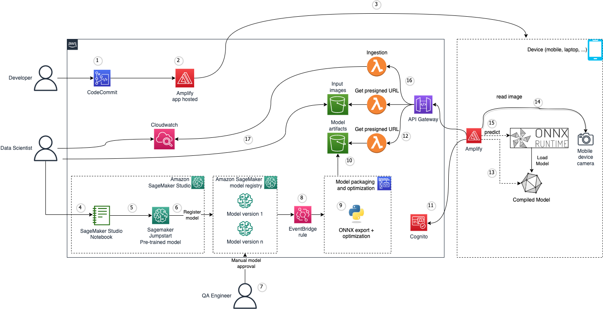

# Onnx ML in the browser

This code sample provides an end-to-end solution that manages the lifecycle of ML models deployed on a PC/mobile device. 

A web application built and deployed with [AWS Amplify](https://aws.amazon.com/amplify/?trk=66d9071f-eec2-471d-9fc0-c374dbda114d&sc_channel=ps&ef_id=EAIaIQobChMI4KyigqSx_gIVzhXUAR3ZDgweEAAYASAAEgIjGPD_BwE:G:s&s_kwcid=AL!4422!3!646025317188!e!!g!!amplify%20aws!19610918335!148058249160) provides user with a UI to analyze a picture using a ML model. Once the prediction is done, inference metrics along with the image used are pushed to the cloud.

The inference is performed in JavaScript on device, in the browser using [ONNX Runtime web](https://www.npmjs.com/package/onnxruntime-web). ONNX Runtime Web can run on both CPU and GPU. On CPU side, WebAssembly is adopted to execute the model at near-native speed. For performance acceleration with GPUs, ONNX Runtime Web leverages WebGL, a popular standard for accessing GPU capabilities.

There are benefits to doing on-device and in-browser inference:
- Speed: inferencing is done on the client with models that are optimized to work on less powerful hardware
- Privacy: Since the data never leaves the device for inferencing, it is a safer method of doing inferencing
- Offline. If you lose internet connection, the model will still be able to perform inference
- Cost: You can reduce cloud serving costs by offloading inference to the browser

This code sample sends inference metrics and the input image back to the cloud. You can disable this feature in case of privacy/offline scenarios needs. To do so, comment lines 134 and 135 in [the frontend](./source/frontend/components/ImageCanvas.tsx)

See the following [compatibility list](https://www.npmjs.com/package/onnxruntime-web?activeTab=readme) for supported operating systems and browsers.

# Solution architecture

The idea is to use [Amazon SageMaker](https://aws.amazon.com/sagemaker/) to fine tune an existing pre-trained model using a custom dataset, export the model to the ONNX format, and deploy it on a device. Each user accesses the web application hosted in AWS Amplify through his laptop/mobile device web browser, takes a picture and using the ML model, performs image classification. The web application collects some metrics from the predictions as well as the input image used for inference, and sends them to an [Amazon API Gateway endpoint](https://aws.amazon.com/api-gateway/). [AWS Lambda](https://aws.amazon.com/lambda/) functions process the data and ingests it to [Amazon Cloudwatch](https://aws.amazon.com/cloudwatch/) logs and an [Amazon Simple Storage Service](https://aws.amazon.com/s3/) bucket. This data can then be visualized using an Amazon Cloudwatch dashboard.

1. A developer pushes some changes to the code repository containing the application code
2. Through Amplify, a build is triggered and once successfull, the application is deployed
4. User can access the application from his device using a web browser
5. A data scientist uses [Sagemaker Studio](https://docs.aws.amazon.com/sagemaker/latest/dg/studio.html) to fine tune a pre-trained ML model from [Amazon Sagemaker Jumpstart](https://aws.amazon.com/sagemaker/jumpstart/?sagemaker-data-wrangler-whats-new.sort-by=item.additionalFields.postDateTime&sagemaker-data-wrangler-whats-new.sort-order=desc)
7. The model is registered in the [Sagemaker Model Registry](https://docs.aws.amazon.com/sagemaker/latest/dg/model-registry.html) with a new version, awaiting approval
8. A QA engineer validates manually the model version 
9. When a model is approved, an [Amazon Eventbridge rule](https://docs.aws.amazon.com/eventbridge/latest/userguide/eb-rules.html) triggers a new deployment
10. Model is exported to the ONNX format and/or optimized for the target
11. Model is stored in an [Amazon Simple Storage Service](https://aws.amazon.com/s3/) (S3) bucket
12. The user on his mobile device uses the application to authenticate to the cloud through [Amazon Cognito](https://aws.amazon.com/cognito/)
13. Application sends a request through an [Amazon API Gateway endpoint](https://aws.amazon.com/api-gateway/) endpoint to verify if a new version of a model is available. If yes, a presigned S3 url is generated. Authenticated through cognito, the application downloads the model from S3 to a local directory
14. The model is unpacked and the application loads a new ONNX runtime inference session with the new model
15. User takes a picture using his mobile device camera and loads the image through the mobile app
16. The application runs a prediction based on the acquired image
17. Application logs are captured and published to an API gateway endpoint. Input images are also uploaded to an S3 bucket
18. A Lambda function parses the application logs and parsed data are ingested to [Amazon Cloudwatch logs](https://docs.aws.amazon.com/AmazonCloudWatch/latest/logs/WhatIsCloudWatchLogs.html)
19. A data scientist can access the Cloudwatch dashboard and visualize information about the prediction, as well as the sotrage path of the input images from S3

# Getting started

## Backend

Follow the instructions in the [dedicated README](./source/backend/README.md) to deploy the backend stack

## Front-end

Once the backend is deployed, follow the instructions in the [dedicated README](./source/frontend/README.md) to deploy the frontend stack

# Content Security Legal Disclaimer
The sample code; software libraries; command line tools; proofs of concept; templates; or other related technology (including any of the foregoing that are provided by our personnel) is provided to you as AWS Content under the AWS Customer Agreement, or the relevant written agreement between you and AWS (whichever applies). You should not use this AWS Content in your production accounts, or on production or other critical data. You are responsible for testing, securing, and optimizing the AWS Content, such as sample code, as appropriate for production grade use based on your specific quality control practices and standards. Deploying AWS Content may incur AWS charges for creating or using AWS chargeable resources, such as running Amazon EC2 instances or using Amazon S3 storage.

# Operational Metrics Collection
This solution collects anonymous operational metrics to help AWS improve the quality and features of the solution. Data collection is subject to the AWS Privacy Policy (https://aws.amazon.com/privacy/). To opt out of this feature, simply remove the tag(s) starting with “uksb-” or “SO” from the description(s) in any CloudFormation templates or CDK TemplateOptions (app.py).