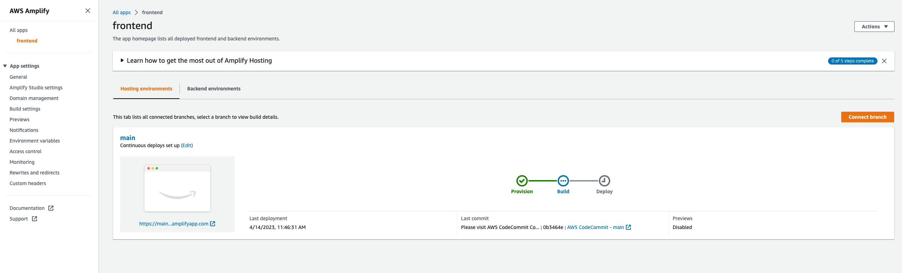
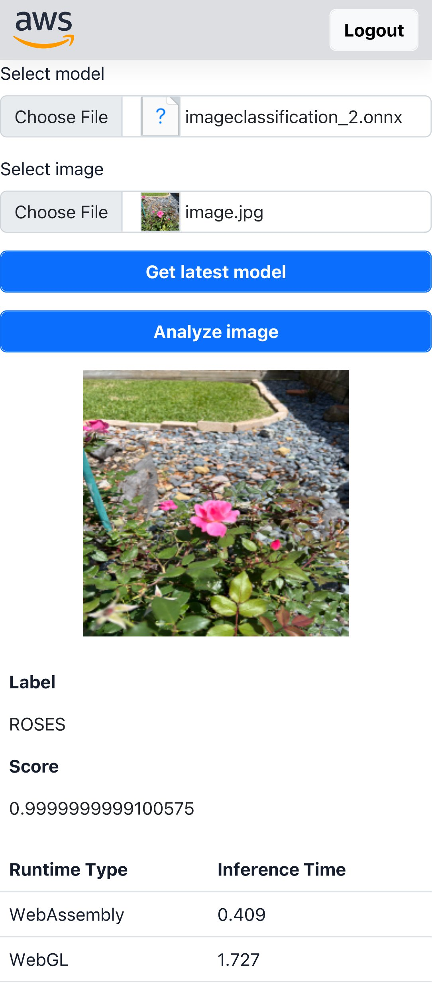

# Onnx ML in the browser - Frontend

This project is built on top of [onnxruntime-nextjs-template](https://github.com/microsoft/onnxruntime-nextjs-template)
package, licensed under MIT. All code changes are licensed under Amazon Software License (ASL) and the existing code snippets have its original license preserved. Refer to both LICENSE-ASL and **LICENSE-MIT for the full description of each license.

# Getting started

## Pre-requisites

> **Warning**
> You need to have the backend stack for your prototype deployed in your account.

- An AWS account. You need to deploy this solution in the same account where you deployed your backend.
- [AWS CLI](https://aws.amazon.com/cli/): configure your credentials

```
aws configure --profile [your-profile] 
AWS Access Key ID [None]: xxxxxx
AWS Secret Access Key [None]:yyyyyyyyyy
Default region name [None]: us-east-1 
Default output format [None]: json
```

- Node.js: v18.12.1
- Npm: v8.19.2
- [AWS CDK](https://github.com/aws/aws-cdk/releases/tag/v2.68.0): 2.68.0
- Git (if using code repository)

## Deploy the solution

Deploy a pipeline stack to create a code repository with a single branch and a CI/CD pipeline.
Then, push the code to the repository for the pipeline to build and deploy the web application.

1. Enter the code sample frontend directory.
    ```shell
    $ cd samples/onnx_accelerator_sample2/source/frontend
    ```
2. Run AWS CLI command line tool to deploy the `onnxacceleratormobilefrontend-dev`.
   It contains an AWS CodeCommit repository and an application definition on AWS Amplify console.
    ```shell
    $ aws cloudformation deploy --template-file template-amplify.yaml --stack-name onnxacceleratormobilefrontend-dev --capabilities CAPABILITY_IAM
    ```
3. Run AWS CLI to retrieve the web application stack outputs and to get the clone URL for the new AWS CodeCommit repository.
    ```shell
    $ aws cloudformation describe-stacks --stack-name onnxacceleratormobilefrontend-dev --query "Stacks[0].Outputs"
    [
        {
            "OutputKey": "RepositoryCloneUrlSsh",
            "OutputValue": "ssh://git-codecommit.us-east-1.amazonaws.com/v1/repos/frontend"
        },
        {
            "OutputKey": "RepositoryCloneUrlGrc",
            "OutputValue": "codecommit::us-east-1://frontend"
        },
        {
            "OutputKey": "RepositoryCloneUrlHttp",
            "OutputValue": "https://git-codecommit.us-east-1.amazonaws.com/v1/repos/frontend"
        }
    ]
    ```
4. Create the initial commit and push it to the AWS CodeCommit repository's `main` branch.
   Replace `<REPOSITORY_CLONE_URL>` with your repository clone URL.
    ```shell
    $ git remote remove origin
    
    $ git remote add origin <REPOSITORY_CLONE_URL>
    
    $ git add --all
    
    $ git commit -m "Initial commit"
    
    $ git push -u origin main
    ```
5. AWS Amplify console should run automatically to create the `main` environment. The web application will get built and deployed.



## Local development connected to the backend

You can also deploy the backend locally. 

1. Run AWS CLI command line tool to get the outputs from the `onnxacceleratormobilebackend-dev`.
   ```shell
   $ aws cloudformation describe-stacks --stack-name onnxacceleratormobilebackend-dev --query "Stacks[0].Outputs"
   [
       {
           "OutputKey": "CognitoUserPoolClientIdABCD1234",
           "OutputValue": "abcdefghijklmno1234567890",
           "ExportName": "onnxacceleratormobilebackend-devCognitoUserPoolClientId"
       },
       {
           "OutputKey": "CognitoUserPoolIdABCD1234",
           "OutputValue": "us-east-1_abc123456",
           "ExportName": "onnxacceleratormobilebackend-devCognitoUserPoolId"
       },
       {
           "OutputKey": "RegionName",
           "OutputValue": "us-east-1",
           "ExportName": "onnxacceleratormobilebackend-devRegionName"
       },
       {
           "OutputKey": "CognitoIdentityPoolIdABCD1234",
           "OutputValue": "us-east-1:aaaaaaaa-bbbb-cccc-dddd-123456789012",
           "ExportName": "onnxacceleratormobilebackend-devCognitoIdentityPoolId"
       },
       {
           "OutputKey": "ApiGwConstructApiGatewayEndpoint888E7071",
           "OutputValue": "https://aaaaaaaaa.execute-api.us-east-1.amazonaws.com",
           "ExportName": "onnxacceleratormobilebackend-devApiGwConstructEndpoint"
       }
   ]

   ```
2. Open the file `.env` file and replace the property values with the values retrieved from the stack outputs.
   ```properties
   NEXT_PUBLIC_REGION_NAME="<REGION_NAME>"
   NEXT_PUBLIC_COGNITO_USER_POOL_ID="<COGNITO_USER_POOL_ID>"
   NEXT_PUBLIC_COGNITO_USER_POOL_CLIENT_ID="<COGNITO_USER_POOL_CLIENT_ID>"
   NEXT_PUBLIC_COGNITO_IDENTITY_POOL_ID="<COGNITO_IDENTITY_POOL_ID>"
   NEXT_PUBLIC_API_GATEWAY_ENDPOINT=<API_GATEWAY_ENDPOINT>
   ```
3. Install the dependencies
    ```shell
    $ npm install
    ```

4. Build the application
   ```shell
    $ npm run build
   ```

5. Run the application
   ```shell
    $ npm start
   ```
    Open [http://localhost:3000](http://localhost:3000) to access the UI in your browser. Your app is deployed !


## Inference

1. Create a user in the Cognito user pool. Go to the [Amazon Cognito page](https://console.aws.amazon.com/cognito/home) in the AWS console, then select the created user pool. Under ```users```, select ```Create user``` and fill in the form
2. Access the webapp (either locally or through the Amplify hosted domain) and sign in using the user credentials you just created
3. Click on ```Get latest model```. This will download the latest version of the model from the deployment package S3 bucket to your local downloads folder. You need to have at least one model exported in that bucket. The README for the backend stack describes the steps to generate a new model
4. Click on ```Select model```. Choose the model you just downloaded at the previous step
4. Click on ```Select image```. Choose either an image from your library or take a picture using your camera
5. Click on ```Analyze image```. This will load the onnx model to memory and perform inference on the image you selected. Once done, some metrics will appear under the image (label, score, performances). Classes are stored in the [data folder](./data/classses.ts). If you fine tune your model with a different dataset, you will need to update this file with the correct classes.
5. Some metrics were sent to Cloudwatch logs (model metadata, input image S3 location, inference metrics). You can access the ```inference``` logstream under the ```/aws/lambda/logsingestion``` log group to view those data. You can also access the cloudwatch dashboard to visualize all the metrics graphically



## Optimize the application

The libraries and model mentioned in the previous steps can be optimized to meet memory and processing demands.

a. Models in ONNX format can be converted to [ORT format](https://onnxruntime.ai/docs/performance/model-optimizations/ort-format-models.html), for optimized model binary size, faster initialization and peak memory usage.

b. The size of the ONNX Runtime itself can reduced by [building a custom package](https://onnxruntime.ai/docs/build/custom.html) that only includes support for your specific model.

c. Tune ONNX Runtime inference session options, including trying different Execution Providers.

## Cloud data streaming

This code sample sends inference metrics and the input image back to the cloud. You can disable this feature in case of privacy/offline scenarios needs. To do so, comment lines 134 and 135 in [the frontend](./components/ImageCanvas.tsx)

## Clean up

Do not forget to delete the stack to avoid unexpected charges

in a shell:

```shell
    $ cdk destroy onnxacceleratormobilefront-dev
```

Then in the AWS console delete the S3 buckets


 